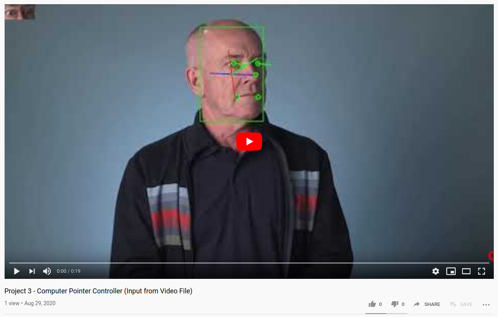
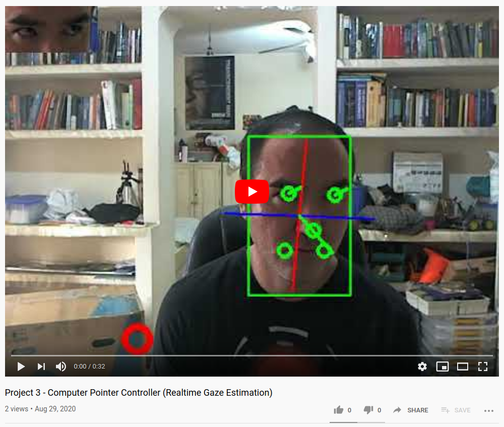
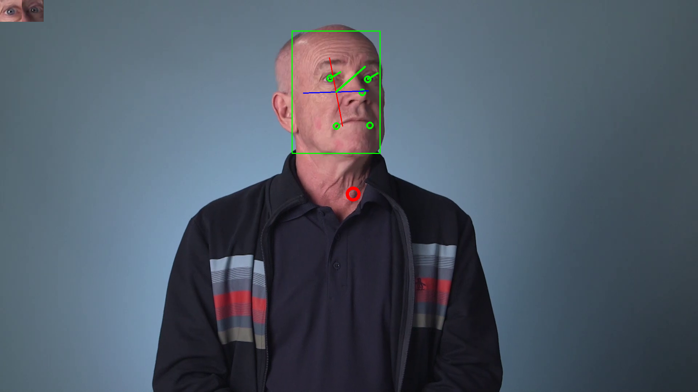
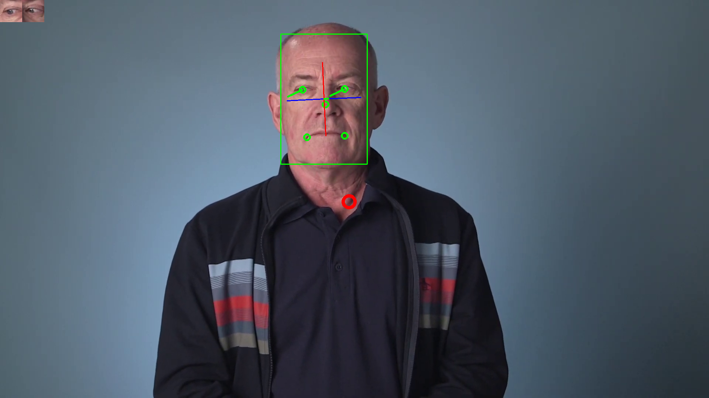
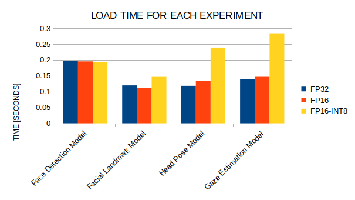
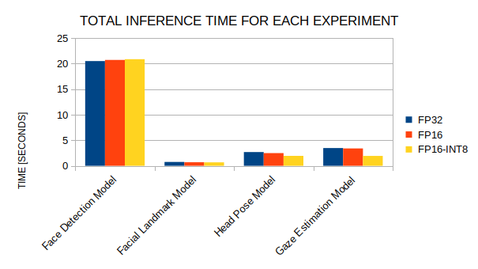
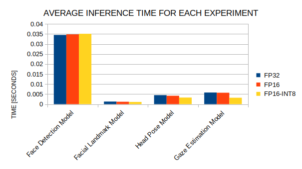
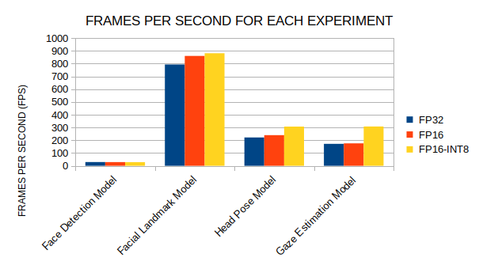
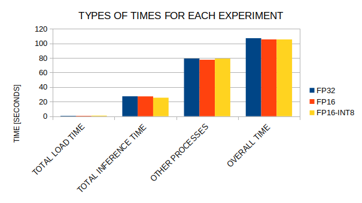
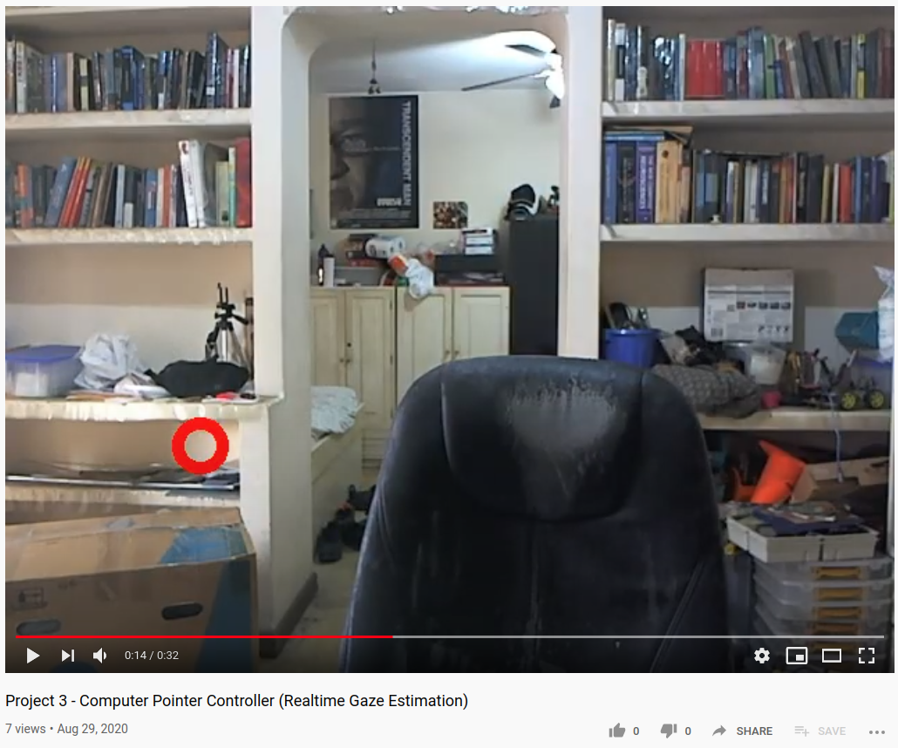

# Computer Pointer Controller

<!-- https://stackoverflow.com/questions/7694887/is-there-a-command-line-utility-for-rendering-github-flavored-markdown -->

The **Computer Pointer Controller project** is the Project 3 of the **Intel® Edge AI for IoT Developers Nanodegree**.

In short, this project estimates the gaze direction of the closest person filmed by a camera.
The estimation can be in realtime by using a camera. Or the App can read a prerecorded video that is stored in your hard disk.

Basically, each frame in the video is processed through this pipeline:

<p align='center'>
 
</p>

Then, the **Mouse Pointer Movement Direction** is fed into the `pyautogui` API that moves the mouse cursor.

Here are the links with the documentation of each model used in this project:
https://docs.openvinotoolkit.org/latest/omz_models_intel_face_detection_adas_binary_0001_description_face_detection_adas_binary_0001.html
https://docs.openvinotoolkit.org/latest/omz_models_intel_landmarks_regression_retail_0009_description_landmarks_regression_retail_0009.html
https://docs.openvinotoolkit.org/latest/omz_models_intel_head_pose_estimation_adas_0001_description_head_pose_estimation_adas_0001.html
https://docs.openvinotoolkit.org/latest/omz_models_intel_gaze_estimation_adas_0002_description_gaze_estimation_adas_0002.html

## Project Set Up and Installation

Do the following steps in order to successfully install and run the project:

### Install Conda

Go to https://docs.conda.io/projects/conda/en/latest/user-guide/install/
and install Conda. Follow the instructions in the website.

### Install the OpenVINO Toolkit

Go to https://software.intel.com/content/www/us/en/develop/tools/openvino-toolkit/choose-download.html
and install the OpenVINO Toolkit. Follow the instructions in the website.

### Create the virtual environment for project isolation

From the following script, copy each command and paste it in the terminal.
These commands will create a virtual environment called `computer_pointer_controller` for project isolation.

**create_conda_environment.sh**
```
#conda remove -n computer_pointer_controller
conda create -n computer_pointer_controller python=3.6
conda info --envs
conda activate computer_pointer_controller
pip install -r requirements.txt
```

The last command installs the requirements by using the `pip` command.
Here are the requirements:

**requirements.txt**
```
image==1.5.27
ipdb==0.12.3
ipython==7.10.2
numpy==1.17.4
Pillow==6.2.1
requests==2.22.0
virtualenv==16.7.9
opencv-python
pyautogui
PyYAML
```

### Download this GitHub repository and install the directory structure

Clone this GitHub repository and install the following directory structure in your computer:

```
$ tree --dirsfirst
.
├── bin
│   ├── demo.mp4
│   ├── demo.mp4.20.png
│   ├── demo.mp4.250.png
│   ├── output.demo.mp4.20.png
│   ├── output.demo.mp4.250.png
│   ├── output_video_camera.mp4
│   ├── output_video.mp4
│   └── tiny_video.mp4
├── images
│   ├── average_inference_times.png
│   ├── camera_demo.png
│   ├── demo.png
│   ├── frames_per_second.png
│   ├── load_times.png
│   ├── no_persons_in_video.png
│   ├── pipeline.png
│   ├── total_inference_times.png
│   └── types_of_times.png
├── models
│   ├── intel
│   │   ├── face-detection-adas-binary-0001
│   │   │   └── FP32-INT1
│   │   │       ├── face-detection-adas-binary-0001.bin
│   │   │       └── face-detection-adas-binary-0001.xml
│   │   ├── gaze-estimation-adas-0002
│   │   │   ├── FP16
│   │   │   │   ├── gaze-estimation-adas-0002.bin
│   │   │   │   └── gaze-estimation-adas-0002.xml
│   │   │   ├── FP16-INT8
│   │   │   │   ├── gaze-estimation-adas-0002.bin
│   │   │   │   └── gaze-estimation-adas-0002.xml
│   │   │   └── FP32
│   │   │       ├── gaze-estimation-adas-0002.bin
│   │   │       └── gaze-estimation-adas-0002.xml
│   │   ├── head-pose-estimation-adas-0001
│   │   │   ├── FP16
│   │   │   │   ├── head-pose-estimation-adas-0001.bin
│   │   │   │   └── head-pose-estimation-adas-0001.xml
│   │   │   ├── FP16-INT8
│   │   │   │   ├── head-pose-estimation-adas-0001.bin
│   │   │   │   └── head-pose-estimation-adas-0001.xml
│   │   │   └── FP32
│   │   │       ├── head-pose-estimation-adas-0001.bin
│   │   │       └── head-pose-estimation-adas-0001.xml
│   │   └── landmarks-regression-retail-0009
│   │       ├── FP16
│   │       │   ├── landmarks-regression-retail-0009.bin
│   │       │   └── landmarks-regression-retail-0009.xml
│   │       ├── FP16-INT8
│   │       │   ├── landmarks-regression-retail-0009.bin
│   │       │   └── landmarks-regression-retail-0009.xml
│   │       └── FP32
│   │           ├── landmarks-regression-retail-0009.bin
│   │           └── landmarks-regression-retail-0009.xml
│   ├── delete_models.sh
│   └── download_models.sh
├── src
│   ├── eye_pointer_app.py
│   ├── input_feeder.py
│   ├── models.py
│   └── mouse_controller.py
├── computer_pointer_controller.log
├── create_conda_environment.sh
├── README.md
├── README.md.pdf
├── requirements.txt
├── run-app-test.sh
├── run-app-with-FP16-INT8-models.sh
├── run-app-with-FP16-models.sh
├── run-app-with-FP32-models.sh
├── run-app-with-image-files.sh
├── run-app-with-SCANNER-ERROR.sh
├── run-app-with-video-camera.sh
├── time_stats.log
└── time_stats.ods

19 directories, 57 files
```

The `bin` directory contains the input and output video files to do the experiments.
It also contains the input and output image files for the experiments with images.

The `images` directory contains the images required to render this README.md file.

The `models` directory contains the Intel models in Intermediate Representation (IR).
And it also contains a script to download the Intel models (download_models.sh).
**You need to execute the script `download_models.sh`. Otherwise you won't be able to use the Intel models.**
(You must type `cd models` first.)

**models/download_models.sh**
```
python /opt/intel/openvino/deployment_tools/tools/model_downloader/downloader.py --name "face-detection-adas-binary-0001"
python /opt/intel/openvino/deployment_tools/tools/model_downloader/downloader.py --name "head-pose-estimation-adas-0001"
python /opt/intel/openvino/deployment_tools/tools/model_downloader/downloader.py --name "landmarks-regression-retail-0009"
python /opt/intel/openvino/deployment_tools/tools/model_downloader/downloader.py --name "gaze-estimation-adas-0002"
```

In the `models` directory, there is also a script to delete the models (delete_models.sh), in case you want to save disk space.

**models/delete_models.sh**
```
rm -r intel
```

The `src` directory has 4 Python files:
- `eye_pointer_app.py` (the Main class)
- `input_feeder.py` (a class to read frames from video files)
- `models.py` (all the Model classes)
- `mouse_controller.py` (a class to handle mouse movements)

## Demos

If you want to run a basic demo of the project, run the following script.
Basically, it will analyze a prerecorded video `bin/demo.mp4` with FP32 models:

**run-app-with-FP32-models.sh**
```
FACE_DETECTION_MODEL=models/intel/face-detection-adas-binary-0001/FP32-INT1/face-detection-adas-binary-0001.xml
FACIAL_LANDMARK_MODEL=models/intel/landmarks-regression-retail-0009/FP32/landmarks-regression-retail-0009.xml
HEAD_POSE_MODEL=models/intel/head-pose-estimation-adas-0001/FP32/head-pose-estimation-adas-0001.xml
GAZE_ESTIMATION_MODEL=models/intel/gaze-estimation-adas-0002/FP32/gaze-estimation-adas-0002.xml

python src/eye_pointer_app.py --input_type video --input_file bin/demo.mp4 --output_file bin/output_video.mp4 --device CPU --face_detection_model $FACE_DETECTION_MODEL --facial_landmark_model $FACIAL_LANDMARK_MODEL --head_pose_model $HEAD_POSE_MODEL --gaze_estimation_model $GAZE_ESTIMATION_MODEL --show_face_detection --show_facial_landmarks --show_head_pose --show_gaze_estimation --show_pointer --show_time_stats --experiment_name FP32
```

Click on the demo:

<h3 align='center'>
 <a href='https://youtu.be/2bNq1FVscig'>
  <br/>
  https://youtu.be/2bNq1FVscig
 </a>
</h3>

If you want to test the project with your own video camera to estimate your gaze in realtime, use the following script:

**run-app-with-video-camera.sh**
```
FACE_DETECTION_MODEL=models/intel/face-detection-adas-binary-0001/FP32-INT1/face-detection-adas-binary-0001.xml
FACIAL_LANDMARK_MODEL=models/intel/landmarks-regression-retail-0009/FP16/landmarks-regression-retail-0009.xml
HEAD_POSE_MODEL=models/intel/head-pose-estimation-adas-0001/FP16/head-pose-estimation-adas-0001.xml
GAZE_ESTIMATION_MODEL=models/intel/gaze-estimation-adas-0002/FP16/gaze-estimation-adas-0002.xml

python src/eye_pointer_app.py --input_type cam --output_file bin/output_video_camera.mp4 --device CPU --face_detection_model $FACE_DETECTION_MODEL --facial_landmark_model $FACIAL_LANDMARK_MODEL --head_pose_model $HEAD_POSE_MODEL --gaze_estimation_model $GAZE_ESTIMATION_MODEL --show_face_detection --show_facial_landmarks --show_head_pose --show_gaze_estimation --show_pointer
```

Click on the demo:

<h3 align='center'>
 <a href='https://youtu.be/iWgMgyAYNfk'>
  <br/>
  https://youtu.be/iWgMgyAYNfk
 </a>
</h3>

If you want to analyze images by using the same pipeline, use the following script:

**run-app-with-image-files.sh**
```
FACE_DETECTION_MODEL=models/intel/face-detection-adas-binary-0001/FP32-INT1/face-detection-adas-binary-0001.xml
FACIAL_LANDMARK_MODEL=models/intel/landmarks-regression-retail-0009/FP32/landmarks-regression-retail-0009.xml
HEAD_POSE_MODEL=models/intel/head-pose-estimation-adas-0001/FP32/head-pose-estimation-adas-0001.xml
GAZE_ESTIMATION_MODEL=models/intel/gaze-estimation-adas-0002/FP32/gaze-estimation-adas-0002.xml

python src/eye_pointer_app.py --input_type image --input_file bin/demo.mp4.20.png --output_file bin/output.demo.mp4.20.png --device CPU --face_detection_model $FACE_DETECTION_MODEL --facial_landmark_model $FACIAL_LANDMARK_MODEL --head_pose_model $HEAD_POSE_MODEL --gaze_estimation_model $GAZE_ESTIMATION_MODEL --show_face_detection --show_facial_landmarks --show_head_pose --show_gaze_estimation

python src/eye_pointer_app.py --input_type image --input_file bin/demo.mp4.250.png --output_file bin/output.demo.mp4.250.png --device CPU --face_detection_model $FACE_DETECTION_MODEL --facial_landmark_model $FACIAL_LANDMARK_MODEL --head_pose_model $HEAD_POSE_MODEL --gaze_estimation_model $GAZE_ESTIMATION_MODEL --show_face_detection --show_facial_landmarks --show_head_pose --show_gaze_estimation
```

<h3 align='center'>
 
 
</h3>

If you want to change the input type to SCANNER, the project will tell you that **scanners are not supported**:

**run-app-with-SCANNER-ERROR.sh**
```
FACE_DETECTION_MODEL=models/intel/face-detection-adas-binary-0001/FP32-INT1/face-detection-adas-binary-0001.xml
FACIAL_LANDMARK_MODEL=models/intel/landmarks-regression-retail-0009/FP16/landmarks-regression-retail-0009.xml
HEAD_POSE_MODEL=models/intel/head-pose-estimation-adas-0001/FP16/head-pose-estimation-adas-0001.xml
GAZE_ESTIMATION_MODEL=models/intel/gaze-estimation-adas-0002/FP16/gaze-estimation-adas-0002.xml

python src/eye_pointer_app.py --input_type SCANNER --output_file bin/output_video_camera.mp4 --device CPU --face_detection_model $FACE_DETECTION_MODEL --facial_landmark_model $FACIAL_LANDMARK_MODEL --head_pose_model $HEAD_POSE_MODEL --gaze_estimation_model $GAZE_ESTIMATION_MODEL --show_face_detection --show_facial_landmarks --show_head_pose --show_gaze_estimation
```

```
./run-app-with-SCANNER-ERROR.sh 
...
2020-08-30 04:04:22,058 ERROR: 
"SCANNER" is not a supported input type. Supported input types are "video", "cam", or "image".
```

## Documentation

Here is a summary of the command line arguments that the project supports:

```
$ python src/eye_pointer_app.py --help
usage: eye_pointer_app.py [-h] --input_type INPUT_TYPE
                          [--input_file INPUT_FILE] --output_file OUTPUT_FILE
                          [--log_file LOG_FILE] [--device DEVICE]
                          [--extensions EXTENSIONS]
                          [--prob_threshold PROB_THRESHOLD]
                          --face_detection_model FACE_DETECTION_MODEL
                          --facial_landmark_model FACIAL_LANDMARK_MODEL
                          --head_pose_model HEAD_POSE_MODEL
                          --gaze_estimation_model GAZE_ESTIMATION_MODEL
                          [--show_face_detection] [--show_facial_landmarks]
                          [--show_head_pose] [--show_gaze_estimation]
                          [--show_pointer] [--verbose] [--show_time_stats]
                          [--experiment_name EXPERIMENT_NAME]

optional arguments:
  -h, --help            show this help message and exit
  --input_type INPUT_TYPE
                        Input type can be "video", "cam", or "image".
  --input_file INPUT_FILE
                        Path to image or video file.
  --output_file OUTPUT_FILE
                        Path to the output video file.
  --log_file LOG_FILE   Path to the log file.
  --device DEVICE       Specify the target device to infer on: CPU (default),
                        GPU, FPGA, or MYRIAD are acceptable.
  --extensions EXTENSIONS
                        Specify CPU extensions.
  --prob_threshold PROB_THRESHOLD
                        Probability threshold for filtering detections. (0.5
                        by default)
  --face_detection_model FACE_DETECTION_MODEL
                        Path to the XML file with the face detection model.
  --facial_landmark_model FACIAL_LANDMARK_MODEL
                        Path to the XML file with the facial landmark model.
  --head_pose_model HEAD_POSE_MODEL
                        Path to the XML file with the head pose model.
  --gaze_estimation_model GAZE_ESTIMATION_MODEL
                        Path to the XML file with the gaze estimation model.
  --show_face_detection
                        Show face detection in output video.
  --show_facial_landmarks
                        Show facial landmarks in output video.
  --show_head_pose      Show head pose in output video.
  --show_gaze_estimation
                        Show gaze estimation in output video.
  --show_pointer        Show pointer in output video.
  --verbose             Print all inferences of models in terminal.
  --show_time_stats     Show summary of time statistics.
  --experiment_name EXPERIMENT_NAME
                        Name of experiment.
```

## Benchmarks and Discussions about the Results

Three experiments were done in order to obtain the statistics:

**run-app-with-FP32-models.sh**
```
FACE_DETECTION_MODEL=models/intel/face-detection-adas-binary-0001/FP32-INT1/face-detection-adas-binary-0001.xml
FACIAL_LANDMARK_MODEL=models/intel/landmarks-regression-retail-0009/FP32/landmarks-regression-retail-0009.xml
HEAD_POSE_MODEL=models/intel/head-pose-estimation-adas-0001/FP32/head-pose-estimation-adas-0001.xml
GAZE_ESTIMATION_MODEL=models/intel/gaze-estimation-adas-0002/FP32/gaze-estimation-adas-0002.xml

python src/eye_pointer_app.py --input_type video --input_file bin/demo.mp4 --output_file bin/output_video.mp4 --device CPU --face_detection_model $FACE_DETECTION_MODEL --facial_landmark_model $FACIAL_LANDMARK_MODEL --head_pose_model $HEAD_POSE_MODEL --gaze_estimation_model $GAZE_ESTIMATION_MODEL --show_face_detection --show_facial_landmarks --show_head_pose --show_gaze_estimation --show_pointer --show_time_stats --experiment_name FP32
```

**run-app-with-FP16-models.sh**
```
FACE_DETECTION_MODEL=models/intel/face-detection-adas-binary-0001/FP32-INT1/face-detection-adas-binary-0001.xml
FACIAL_LANDMARK_MODEL=models/intel/landmarks-regression-retail-0009/FP16/landmarks-regression-retail-0009.xml
HEAD_POSE_MODEL=models/intel/head-pose-estimation-adas-0001/FP16/head-pose-estimation-adas-0001.xml
GAZE_ESTIMATION_MODEL=models/intel/gaze-estimation-adas-0002/FP16/gaze-estimation-adas-0002.xml

python src/eye_pointer_app.py --input_type video --input_file bin/demo.mp4 --output_file bin/output_video.mp4 --device CPU --face_detection_model $FACE_DETECTION_MODEL --facial_landmark_model $FACIAL_LANDMARK_MODEL --head_pose_model $HEAD_POSE_MODEL --gaze_estimation_model $GAZE_ESTIMATION_MODEL --show_face_detection --show_facial_landmarks --show_head_pose --show_gaze_estimation --show_pointer --show_time_stats --experiment_name FP16
```

**run-app-with-FP16-INT8-models.sh**
```
FACE_DETECTION_MODEL=models/intel/face-detection-adas-binary-0001/FP32-INT1/face-detection-adas-binary-0001.xml
FACIAL_LANDMARK_MODEL=models/intel/landmarks-regression-retail-0009/FP16-INT8/landmarks-regression-retail-0009.xml
HEAD_POSE_MODEL=models/intel/head-pose-estimation-adas-0001/FP16-INT8/head-pose-estimation-adas-0001.xml
GAZE_ESTIMATION_MODEL=models/intel/gaze-estimation-adas-0002/FP16-INT8/gaze-estimation-adas-0002.xml

python src/eye_pointer_app.py --input_type video --input_file bin/demo.mp4 --output_file bin/output_video.mp4 --device CPU --face_detection_model $FACE_DETECTION_MODEL --facial_landmark_model $FACIAL_LANDMARK_MODEL --head_pose_model $HEAD_POSE_MODEL --gaze_estimation_model $GAZE_ESTIMATION_MODEL --show_face_detection --show_facial_landmarks --show_head_pose --show_gaze_estimation --show_pointer --show_time_stats --experiment_name FP16-INT8
```

The results were saved in the file [time_stats.log](time_stats.log).
By using LibreOffice Calc, those statistics were selectively copied and pasted in the file [time_stats.ods](time_stats.ods).
Here is a summary of the statistics found in time_stats.ods:

**LOAD TIME [SECONDS]**
|MODEL	|FP32	|FP16	|FP16-INT8|
|-------|-------:|-------:|-------:|
|Face Detection Model	|0.1976	|0.1956	|0.1942|
|Facial Landmark Model	|0.1197	|0.1108	|0.1467|
|Head Pose Model	|0.1184	|0.1333	|0.2391|
|Gaze Estimation Model	|0.1396	|0.1468	|0.2843|
			
<p align='center'>
 
</p>

The results of **Load Time** suggest the FP16-INT8 models take longer to load in comparison to the FP16 and FP32 models.
The reason is unknown and counter-intuitive.

**TOTAL INFERENCE TIME [SECONDS]**
|MODEL	|FP32	|FP16	|FP16-INT8|
|-------|-------:|-------:|-------:|
|Face Detection Model	|20.4982	|20.7179	|20.8667|
|Facial Landmark Model	|0.7504	|0.6918	|0.6754|
|Head Pose Model	|2.6885	|2.4822	|1.9398|
|Gaze Estimation Model	|3.4707	|3.3907	|1.933|
			
<p align='center'>
 
</p>

The results of **Total Inference Time** suggest the FP16-INT8 models are faster than the FP16 and FP32 models when using the Head Pose and Gaze Estimation models.
Perhaps this is caused by the lesser amount of bits in the FP16 models.
Whereas all models have similar inference times when using the Face Detection and Facial Landmark models.

Most of the inference time is spent in Face Detection. So, we must focus on improving the performance of Face Detection by using the Intel Tools.

**AVERAGE INFERENCE TIME [SECONDS]**
|MODEL	|FP32	|FP16	|FP16-INT8|
|-------|-------:|-------:|-------:|
|Face Detection Model	|0.0345	|0.0348	|0.0351|
|Facial Landmark Model	|0.0013	|0.0012	|0.0011|
|Head Pose Model	|0.0045	|0.0042	|0.0033|
|Gaze Estimation Model	|0.0058	|0.0057	|0.0032|
			
<p align='center'>
 
</p>

The results of **Average Inference Time** suggest the FP16-INT8 models are faster than the FP16 and FP32 models when using the Head Pose and Gaze Estimation models.
Perhaps this is caused by the lesser amount of bits in the FP16 models.
Whereas all models have similar inference times when using the Face Detection and Facial Landmark models.

Most of the inference time is spent in Face Detection. So, we must focus on improving the performance of Face Detection by using the Intel Tools.

**FRAMES PER SECOND**
|MODEL	|FP32	|FP16	|FP16-INT8|
|-------|-------:|-------:|-------:|
|Face Detection Model	|29.0269	|28.7191	|28.5143|
|Facial Landmark Model	|792.9129	|860.0439	|880.919|
|Head Pose Model	|221.3162	|239.7078	|306.7331|
|Gaze Estimation Model	|171.4342	|175.4809	|307.8149|

<p align='center'>
 
</p>

The results of **Frames per Second** suggest FP16-INT8 models compute more frames per second, followed by FP16 models and FP32 models, in that order.
Perhaps this is caused by the lesser amount of bits in the FP16 models.

Face Detection has the lowest amount of frames per second. So, we must focus on improving the performance of Face Detection by using the Intel Tools.

**TYPES OF TIMES [SECONDS]**
|MODEL	|TOTAL LOAD TIME	|TOTAL INFERENCE TIME	|OTHER PROCESSES	|OVERALL TIME|
|-------|-------:|-------:|-------:|-------:|
|FP32	|0.5753	|27.4078	|79.0976	|107.0807|
|FP16	|0.5865	|27.2826	|77.4659	|105.335|
|FP16-INT8	|0.8643	|25.4149	|79.0523	|105.3315|

<p align='center'>
 
</p>

Load times are much smaller than the rest of processes. Because load times are simple processes that are executed only once.
Whereas the inference times are done many times, 1 time per each frame in the video.
Surprisingly, the inference times are not the bottleneck of computations.
Why? Because other processes like rendering the video and preprocessing inputs and outputs are more computationally expensive.

FP32 models are slightly slower than FP16 and FP16-INT8 models. But the differences are not significant.
One can safely use FP32 models in order to gain a little bit more of accuracy, without sacrificing too much performance.

## Stand Out Suggestions
From all stand-out suggestions, I only tried:
- handling multiple persons in video;
- and handling no persons in video.

### Edge Case: Handling Multiple Persons in Video.

The `FaceDetectionModel` class can detect multiple persons in video. 
But it will only process the person who is closest to the camera.
In other words, only the bigger face with bigger area will be analyzed:

**src/models.py**
```
    def preprocess_output(self):
        detections = self.objects2['detection_out']
        self.fds = []
        for i in range(detections.shape[2]):
            detection = detections[0, 0, i]
            prob = detection[2]
            if prob < self.prob_threshold: break
            self.fds.append(FaceDetection(detection))
        self.fds = sorted(self.fds, key = lambda fd: fd.area, reverse = True)
        self.output_image = self.image.copy()
        for fd in self.fds: 
            fd.compute_points(self.output_image)
            if self.main_app.args.show_face_detection: fd.draw_rectangle(self.output_image)
            if self.main_app.args.verbose: logging.info('fd: {}'.format(fd))
        if len(self.fds) > 0: self.face_image = self.fds[0].crop_image(self.image)
```

### Edge Case: Handling No Persons in Video.

The `Main` class can handle the special case in the pipeline in which there are no persons in video.
In this case, the pipeline is shorter because only the mouse pointer is drawn:

**src/eye_pointer_app.py**
```
    def process_frame(self, frame):
        self.face_detection_model.image = frame
        self.face_detection_model.predict()
        if len(self.face_detection_model.fds) == 0: 
            self.gaze_estimation_model.gaze_vector = np.array([0, 0, 0])
            self.move_mouse(self.face_detection_model.output_image)
            return self.face_detection_model.output_image
        self.facial_landmark_model.fds = self.face_detection_model.fds
        self.facial_landmark_model.face_image = self.face_detection_model.face_image
        self.facial_landmark_model.image = frame
        self.facial_landmark_model.output_image = self.face_detection_model.output_image
        self.facial_landmark_model.predict()
        self.head_pose_model.image = frame
        self.head_pose_model.face_image = self.face_detection_model.face_image
        self.head_pose_model.output_image = self.facial_landmark_model.output_image
        self.head_pose_model.fds = self.face_detection_model.fds
        self.head_pose_model.predict()
        self.gaze_estimation_model.landmarks = self.facial_landmark_model.landmarks
        self.gaze_estimation_model.left_eye_image = self.facial_landmark_model.eye0
        self.gaze_estimation_model.right_eye_image = self.facial_landmark_model.eye1
        self.gaze_estimation_model.head_pose_angles = self.head_pose_model.pose.to_numpy()
        self.gaze_estimation_model.output_image = self.head_pose_model.output_image
        self.gaze_estimation_model.predict()
        self.move_mouse(self.gaze_estimation_model.output_image)
        return self.gaze_estimation_model.output_image

```

<p align='center'>
 
</p>
